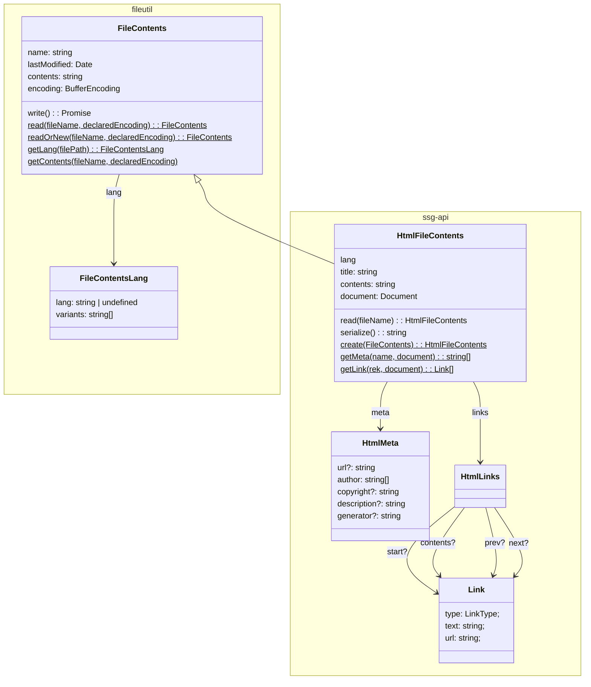

# ssg-api [](https://dl.circleci.com/status-badge/redirect/gh/Javarome/ssg-api/tree/main)

TypeScript API to generate output files from input files.

It can be used to generate:

- **a static website** from HTML templates (but those templates can include client-side JavaScript and CSS of course).
- (and/or) **other files** such as configuration files (for instance converting an `.htaccess` file to a `netlify.toml` file)

To install `ssg-api` as a project dependency:

```
npm install --save ssg-api
```

Then import the required types to implement your own SSG code:

```ts
import { Ssg, SsgContextImpl, SsgConfig } from "ssg-api";

const config: SsgConfig = {
  getOutputPath(context: SsgContext): string {
    return path.join("out", context.file.name)
  }
};
const ssg = new Ssg(config)
  .add(firstStep)
  .add(nextStep); // Write your own SSG steps!

const context = new SsgContextImpl("fr");
try {
  const result = await ssg.start(context);
  context.log("Completed", result);
} catch (err) {
  context.error(err, context.inputFile.name, "=>", context.outputFile.name);
}
```

## Data types

### Steps

[Steps](https://github.com/Javarome/ssg-api/wiki/Steps) can do anything. You can implement your owns, but there are predefined ones.
Check the [documentation](https://github.com/Javarome/ssg-api/wiki) for more.

### Files


