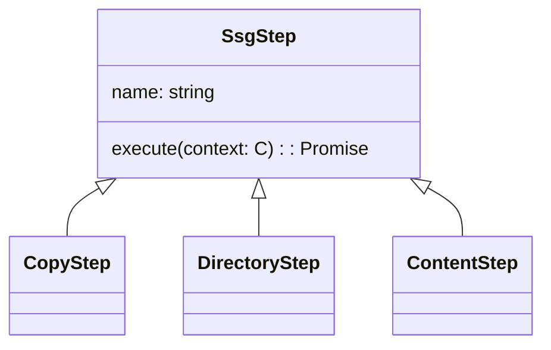

# Steps

In order to be executable by `Ssg`, all steps need to implement the `SsgStep` interface.
Steps can specify a custom `name`, and implement their work in their `execute()` method implementation,
which is provided a `Context` with all the information to work with (current `file`, `language`(s) etc.).

Each step implementation is typically instantiated with a configuration.
